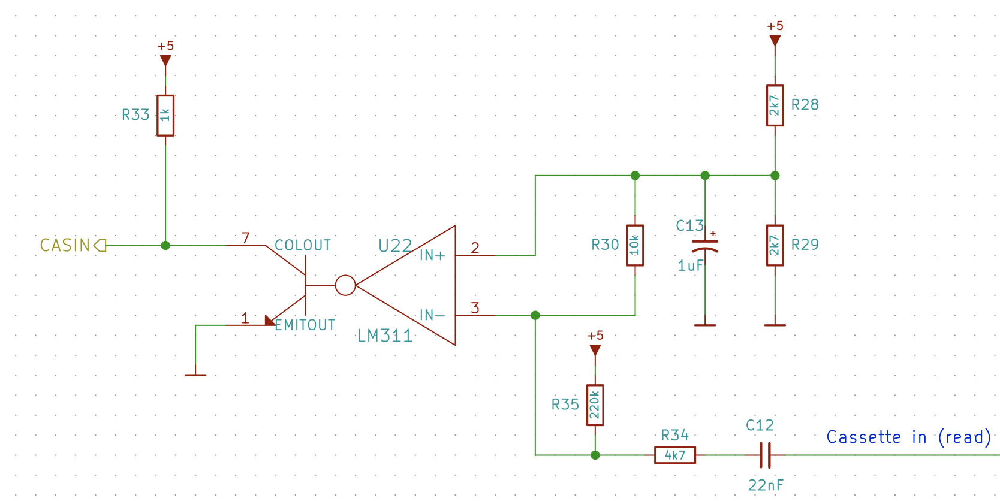

## Cassette Input & Output

As most MSX systems, Artemisa provides a interface to load and save programs and data from an audio cassette. Data is backed up at 1200 or 2400 baud with Frequency Shift Keying (FSK) in the standard "Kansas City" format.

The cassette device is connected to the MSX through a 8-pin DIN connector (DIN 45326) with the following pinout:

| Pin | Name   | Direction | Description    |
| --- | ------ | ---- | -------------- |
| 1   | GND    |      | Ground         |
| 2   | GND    |      | Ground         |
| 3   | GND    |      | Ground         |
| 4   | CMTOUT |      | Sound output   |
| 5   | CMTIN  |      | Sound input    |
| 6   | REM+   |      | Remote control |
| 7   | REM-   |      | Remote control |
| 8   | GND    |      | Ground         |

In summary, pins 4 and 5 carry the sound output and input, respectivelly. Pins 6 and 7 are used to start and stop the cassette motor. They are barely used in practice and Artemisa do not use them (these pins are grounded). The rest of pins are connected to ground.

There are two different circuits in Artemisa to generate cassette input and outputs: one that decodes `CMTIN` and another one that encodes `CMTOUT`.

## Cassette Input Decoding

The audio cassette will send an analog signal to the computer with a form of sinusoidal wave through `CMTIN`. The decoding circuit is based on a LM311 part, a voltage comparator, in order to convert the input wave into a 5V squared signal.

What LM311 does is basically open or close its open-collector output based on the voltage levels of `IN+` and `IN-` pads. If `IN+` voltage is greater than `IN-` voltage, the output transistor will not conduct. Thus, thanks to the pull-up resistor R33, the output will be 5V. If `IN+` voltage is less than `IN-` voltage, the output transistor conducts. Thus, the output will be 0 volts sin emiter is connected to ground.

We make it work by passing the following inputs to `IN+` and `IN-`:

* For `IN+`, we will have a reference voltage that will be the intermediate point of the input waveform. A voltage divider made by R28 and R29 generates ~2.5V for `IN+`. The resistor R30 will provide a DC bias to the input signal around that 2.5 volts. The capacitor C13 will avoid voltage drops drained by R30.
* For `IN-`, we will have the cassete audio input passed through a capacitor C12 to remove any possible  DC bias from the peripheral. Resistor R34 reduces the wave amplitude, especially needed for data recorders that generate signals that exceed the 5 volts peer-to-peek. Resistor R35 raises up the voltage a little bit over reference voltage found in `IN+`. Thanks to that, when no signal is received in the cassette input, the voltage in `IN-` is slightly over voltage in `IN+`, so a logic 0 is read from the device.

As result, `CASIN` line will receive a logic pulse that match the frequency of `CMTIN` line.

## Cassette Output Encoding

The audio cassette will expect an analog signal from the computer with a form of sinusoidal wave through `CMTOUT`. The encoding is implemented by the following RC circuit.

The capacitor C10 removes the DC bias from the output signal. The circuit formed by R25 and C11 implements a [RC integrator](https://www.electronics-tutorials.ws/rc/rc-integrator.html) that causes the input squared signal to acquire a pseudo-sinusoidal waveform. Finally, the combination of R26 and R27 acts as a voltage divider that reduces the amplitude of the signal
